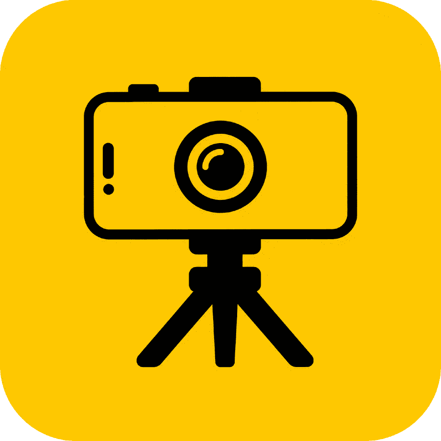
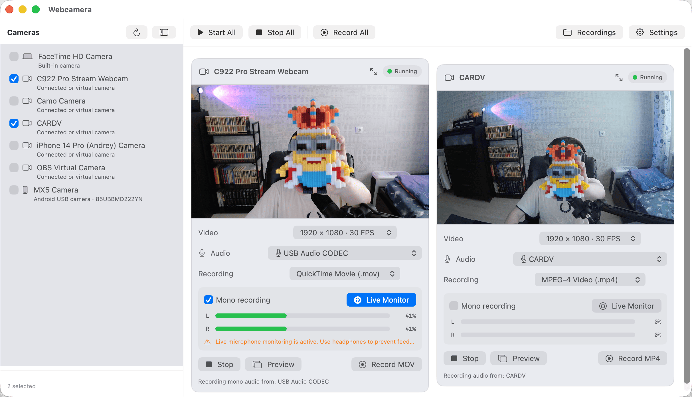
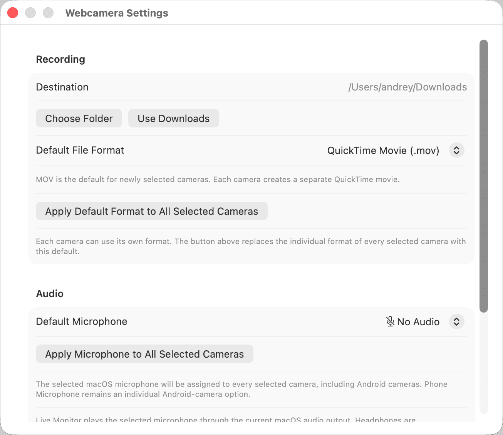
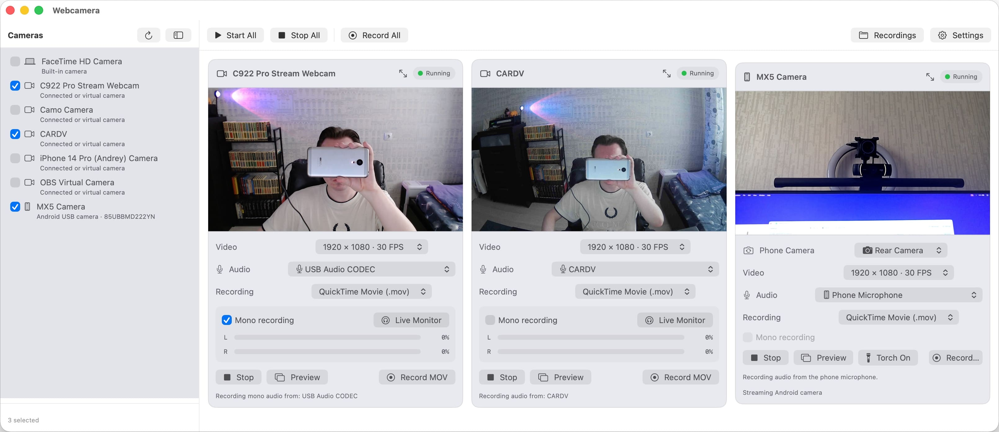
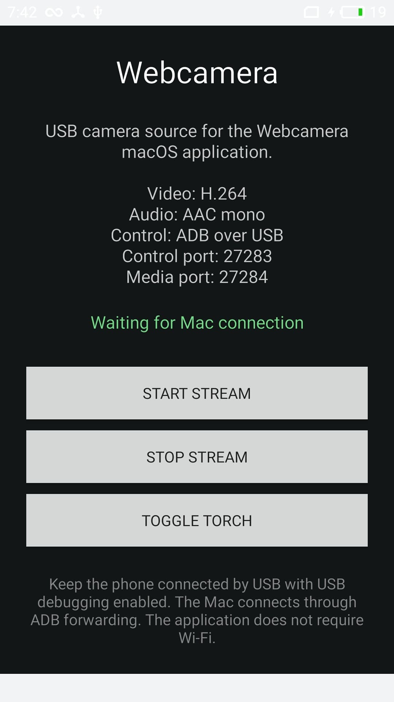
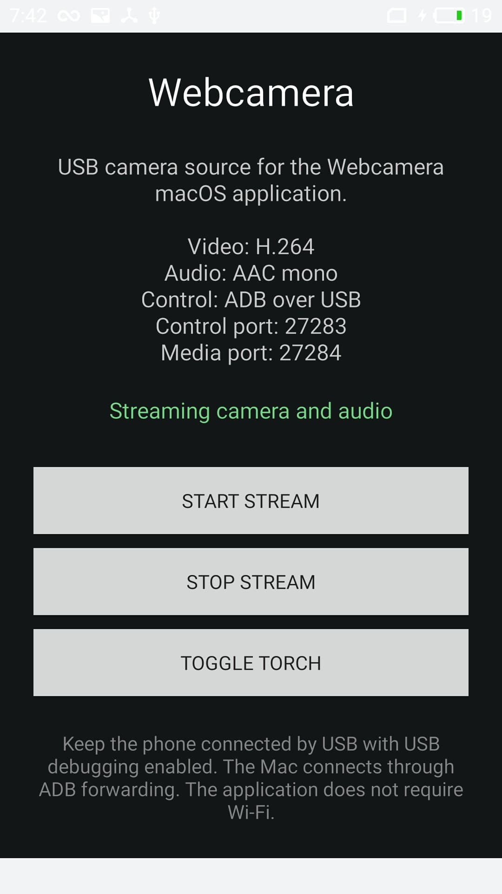

# Webcamera

Webcamera превращает Android-смартфон в дополнительную USB-камеру для macOS и одновременно позволяет работать с обычными встроенными, внешними и виртуальными веб-камерами.

Проект состоит из двух приложений:

- Android-приложение получает изображение и звук с телефона, кодирует их и передаёт на Mac через USB и ADB;
- macOS-приложение обнаруживает локальные камеры и подключённые Android-устройства, показывает несколько видеопотоков одновременно и записывает каждый источник в отдельный файл.

Интернет и подключение устройств к одной сети Wi-Fi для работы не требуются.

## Как это работает

Android-смартфон подключается к Mac по USB.

macOS-приложение обнаруживает телефон через Android Debug Bridge, запускает Android-приложение и создаёт перенаправление локальных TCP-портов.

Android-приложение открывает выбранную камеру телефона, кодирует видео в H.264, кодирует звук с микрофона телефона в AAC и передаёт медиапоток на Mac.

macOS-приложение декодирует полученное видео через VideoToolbox, показывает его рядом с обычными веб-камерами и при необходимости записывает изображение вместе с выбранным источником звука.

Схема работы:

    Камера и микрофон Android-смартфона
                    ↓
            Android-приложение
                    ↓
         H.264-видео и AAC-аудио
                    ↓
           TCP через ADB по USB
                    ↓
             macOS-приложение
                    ↓
       Просмотр, управление и запись

Обычные камеры Mac работают напрямую через AVFoundation и не используют Android-приложение или ADB.

Каждая камера является независимым источником и может иметь собственные:

- разрешение и частоту кадров;
- источник звука;
- режим моно или стерео;
- формат записи;
- состояние предпросмотра;
- состояние записи;
- отдельное окно предпросмотра.

## Возможности

### Android-приложение

- передача изображения с камеры телефона на Mac через USB;
- передача звука с микрофона телефона;
- работа без Wi-Fi и без доступа в интернет;
- выбор передней или задней камеры;
- запуск и остановка видеопотока;
- включение и выключение фонарика;
- отображение состояния подключения;
- отображение состояния трансляции;
- H.264-кодирование видео;
- AAC-кодирование аудио;
- работа через локальные TCP-серверы и ADB port forwarding;
- совместимость с Android 5.1;
- поддержка Meizu MX5 M575H с Flyme 6.2.0.0G;
- собственная иконка приложения.

### macOS-приложение

- поддержка macOS 14 и более новых версий;
- обнаружение встроенных камер Mac;
- обнаружение внешних USB-камер;
- поддержка виртуальных камер, доступных через AVFoundation;
- обнаружение подключённых Android-устройств;
- одновременный просмотр нескольких камер;
- независимый запуск и остановка каждой камеры;
- одновременный запуск и остановка всех выбранных камер;
- выбор разрешения и частоты кадров для каждого источника;
- выбор микрофона отдельно для каждой камеры;
- использование микрофона Android-смартфона;
- использование встроенного микрофона Mac;
- использование внешних микрофонов и аудиоинтерфейсов;
- отключение звука для отдельной камеры;
- живое прослушивание выбранного микрофона;
- отображение уровня левого и правого аудиоканала;
- запись и прослушивание в моно;
- независимая запись каждой камеры;
- одновременная запись нескольких камер;
- выбор MOV или MP4 отдельно для каждой камеры;
- общий формат записи для всех выбранных камер;
- общий микрофон для всех выбранных камер;
- выбор папки для сохранения записей;
- отдельное окно предпросмотра для каждой камеры;
- управление фонариком Android-смартфона;
- собственная иконка приложения.

## Источники камеры

Webcamera может одновременно работать с несколькими типами источников:

    Встроенная камера Mac
    Внешняя USB-камера
    Виртуальная камера AVFoundation
    Камера Android-смартфона через USB

Доступные камеры отображаются в боковом меню macOS-приложения.

Каждый источник можно выбрать или отключить независимо от остальных.

Подключённый Android-смартфон отображается в том же списке, что и обычные камеры.

## Запись

Каждая выбранная камера записывается в отдельный файл.

Для разных камер можно одновременно использовать разные настройки.

Пример:

    Встроенная камера Mac → MOV + встроенный микрофон
    USB-веб-камера        → MP4 + внешний микрофон
    Android-смартфон      → MOV + микрофон телефона

Поддерживаемые форматы:

    QuickTime Movie (.mov)
    MPEG-4 Video (.mp4)

MOV записывается напрямую.

Для MP4 приложение сначала создаёт временную MOV-запись, а после завершения преобразует её в MP4.

Если преобразование завершится с ошибкой, временный MOV-файл сохраняется, чтобы запись не была потеряна.

По умолчанию записи сохраняются в папку `Загрузки`.

Папку можно изменить в настройках приложения.

## Установка

Скачайте файлы из последнего GitHub Release:

- `Webcamera-Android-<version>.apk`;
- `Webcamera-macOS-<version>.zip`.

### Android

1. Разрешите установку приложений из неизвестных источников.
2. Установите APK на смартфон.
3. Включите режим разработчика.
4. Включите отладку по USB.
5. Подключите смартфон к Mac кабелем USB.
6. Подтвердите разрешение на USB-отладку, если Android покажет соответствующий запрос.
7. Откройте приложение Webcamera.

Android-приложение рассчитано на Android 5.1 и более новые совместимые версии Android.

Основное тестовое устройство:

    Meizu MX5 M575H
    Android 5.1
    Flyme 6.2.0.0G

### macOS

1. Распакуйте архив.
2. Переместите `Webcamera.app` в папку `Applications`.
3. Запустите приложение.
4. При первом запуске macOS может показать предупреждение для неподписанного или ненотаризованного приложения. В таком случае нажмите по приложению правой кнопкой и выберите `Открыть`.

Для работы Android-источника на Mac должен быть установлен Android Debug Bridge.

Проверить его наличие можно командой:

    adb version

Webcamera поддерживает macOS 14 и более новые версии.

## Первоначальная настройка

### 1. Предоставление разрешений камеры и микрофона

При первом запуске Webcamera запросит разрешение на использование камеры.

Разрешение необходимо для обнаружения, отображения и записи встроенных и внешних камер, подключённых к Mac.

Подтвердите запрос macOS.

После выбора источника звука приложение также запросит разрешение на использование микрофона.

Разрешение микрофона необходимо для:

- записи звука;
- выбора встроенного или внешнего микрофона;
- живого прослушивания;
- отображения уровня сигнала;
- записи в моно или стерео.

Разрешите приложению доступ к камере и микрофону, чтобы все функции работали правильно.

При необходимости разрешения можно проверить вручную:

    Системные настройки
    → Конфиденциальность и безопасность
    → Камера

и:

    Системные настройки
    → Конфиденциальность и безопасность
    → Микрофон

### 2. Главное окно macOS-приложения

После предоставления разрешений откроется главное окно Webcamera.

В левой части окна находится меню со всеми обнаруженными источниками:

- встроенными камерами Mac;
- внешними USB-камерами;
- виртуальными камерами;
- подключёнными Android-устройствами.

Боковое меню можно скрыть или снова открыть.

Каждую камеру можно выбрать отдельно. Карточки выбранных камер отображаются в правой части окна.

В карточке обычной веб-камеры можно:

- выбрать доступное разрешение и частоту кадров;
- выбрать источник звука;
- отключить запись звука;
- выбрать формат записи MOV или MP4;
- включить запись в моно;
- включить живое прослушивание микрофона;
- проверить уровни левого и правого аудиоканала;
- запустить или остановить камеру;
- начать или остановить запись;
- открыть изображение в отдельном окне с помощью кнопки `Preview`.

При первом выборе камеры Webcamera пытается автоматически подобрать связанный с ней микрофон, если такой источник доступен.

Вместо него можно выбрать любой другой микрофон, обнаруженный macOS:

- встроенный микрофон Mac;
- микрофон веб-камеры;
- внешний USB-микрофон;
- вход аудиоинтерфейса;
- другой источник, доступный через AVFoundation.

Кнопка `Live Monitor` позволяет прослушать выбранный источник через текущий аудиовыход macOS.

Во избежание акустической обратной связи рекомендуется использовать наушники.

В верхней панели находятся общие элементы управления:

- `Start All` — запустить все выбранные камеры;
- `Stop All` — остановить все активные камеры;
- `Record All` — начать запись всех запущенных камер;
- `Stop Recording` — остановить все активные записи;
- `Recordings` — открыть папку с сохранёнными файлами;
- `Settings` — открыть настройки приложения.

По умолчанию кнопка `Recordings` открывает папку `Загрузки`.

### 3. Настройки записи и звука

Окно настроек открывается кнопкой `Settings`.

В настройках можно:

- выбрать папку для сохранения записей;
- вернуть сохранение в папку `Загрузки`;
- выбрать формат записи по умолчанию;
- применить выбранный формат ко всем активным камерам;
- выбрать микрофон по умолчанию;
- применить выбранный микрофон ко всем активным камерам.

Настройка формата по умолчанию применяется к новым выбранным камерам.

Кнопка применения ко всем камерам заменяет индивидуальный формат каждой выбранной камеры выбранным общим значением.

Аналогично можно выбрать один системный микрофон и применить его ко всем выбранным источникам.

Индивидуальные настройки камеры после этого по-прежнему можно изменить отдельно.

Настройки камеры или звука нельзя менять во время активной записи соответствующего источника.

### 4. Android-смартфон в macOS-приложении

После подключения смартфона через USB и успешного обнаружения ADB он появляется в боковом меню как отдельная Android-камера.

В карточке Android-камеры можно:

- переключаться между передней и задней камерой телефона;
- выбрать доступное разрешение и частоту кадров;
- выбрать микрофон телефона;
- выбрать любой доступный микрофон macOS;
- полностью отключить звук;
- выбрать MOV или MP4;
- запустить и остановить поток;
- начать и остановить запись;
- открыть отдельное окно предпросмотра;
- включить или выключить фонарик телефона.

По умолчанию для Android-источника выбирается микрофон телефона.

Вместо него можно выбрать встроенный микрофон Mac, внешний микрофон или другой источник, обнаруженный системой.

Кнопка фонарика доступна только для камеры телефона, которая поддерживает соответствующую функцию.

Обычно это задняя камера.

### 5. Android-приложение до подключения

После запуска Android-приложение показывает текущее состояние сервиса и подключения.

Пока Mac не подключился к Android-приложению, на экране отображается состояние ожидания.

Для начала работы нажмите кнопку `Start Stream`.

После этого приложение подготовит камеру, кодировщик и локальные серверы.

Mac должен быть подключён к телефону по USB, а USB-отладка должна быть разрешена.

Кнопка `Stop Stream` используется для принудительной остановки видеопотока.

Фонарик также можно включить или выключить непосредственно в Android-приложении.

### 6. Android-приложение во время трансляции

После успешного подключения Mac и запуска камеры Android-приложение показывает состояние активной трансляции.

Во время трансляции изображение с телефона отображается в macOS-приложении.

Управлять камерой можно как с телефона, так и с Mac.

Остановка потока на телефоне завершает передачу изображения.

Остановка камеры в macOS-приложении отправляет соответствующую команду Android-приложению.

Запись выполняется на Mac, поэтому видеозаписи не сохраняются в памяти телефона.

## Повторный запуск

После первоначальной настройки обычно достаточно:

1. подключить Android-смартфон к Mac через USB;
2. убедиться, что на телефоне включена USB-отладка;
3. подтвердить подключение к этому Mac, если Android снова покажет запрос;
4. открыть Webcamera на Mac;
5. открыть Webcamera на смартфоне;
6. нажать `Start Stream` на телефоне;
7. выбрать Android-камеру в боковом меню macOS-приложения;
8. нажать `Start`, если поток не запустился автоматически.

Для обычных встроенных и внешних камер Android-смартфон не требуется.

## USB-соединение

Android-устройство обнаруживается командой:

    adb devices -l

Webcamera использует два локальных порта:

    27283 — управляющее соединение
    27284 — передача видео и аудио

Android-приложение открывает серверы только на локальном интерфейсе телефона.

Mac получает доступ к ним через ADB port forwarding.

Wi-Fi, мобильный интернет и подключение устройств к общей сети не используются.

## Состав проекта

    Webcamera/
    ├── android-app/
    │   └── Android-приложение, камера, кодировщики и TCP-серверы
    ├── macos-app/
    │   └── macOS-приложение, камеры, декодирование и запись
    ├── assets/
    │   ├── исходные изображения иконок
    │   └── изображения для документации
    ├── docs/
    │   └── архитектура, разработка и USB-транспорт
    ├── shared/
    │   └── общая спецификация протокола
    ├── scripts/
    │   └── скрипты проверки, сборки, запуска и создания релиза
    └── .github/
        └── GitHub Actions для сборки Android и macOS

## Сборка из исходного кода

### Android

    cd android-app
    ./gradlew --no-daemon clean assembleDebug

Готовый APK:

    android-app/app/build/outputs/apk/debug/app-debug.apk

Установить приложение на подключённый телефон можно скриптом:

    ./scripts/install-android.sh

### macOS

Проект Xcode:

    macos-app/Webcamera/Webcamera.xcodeproj

Сборка из корня репозитория:

    xcodebuild \
      -project macos-app/Webcamera/Webcamera.xcodeproj \
      -scheme Webcamera \
      -configuration Debug \
      -destination 'platform=macOS' \
      -derivedDataPath macos-app/DerivedData \
      CODE_SIGNING_ALLOWED=NO \
      clean build

Готовое приложение:

    macos-app/DerivedData/Build/Products/Debug/Webcamera.app

Для сборки и запуска также можно использовать скрипт:

    ./scripts/run-macos.sh

## Создание релиза

Создать Android APK и архив macOS-приложения:

    ./scripts/build-release.sh 1.0.0

Готовые файлы:

    release/Webcamera-Android-1.0.0.apk
    release/Webcamera-macOS-1.0.0.zip

## Среда разработки и тестирования

- MacBook Air M2 — macOS Tahoe 26.5.
- Минимальная версия macOS — macOS 14.
- Смартфон Meizu MX5 M575H — Android 5.1, Flyme 6.2.0.0G.
